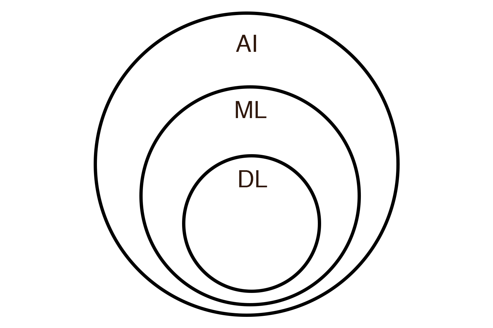

# Intro to Machine Learning

## Repo short URL [ml.sage.codes](https://github.com/sagecodes/intro-machine-learning)

## Do these things first!
- Visit [Google Colab(colab.research.google.com)](colab.research.google.com) and sign-in or Sign-up.

### FAQ: 
- WIFI: `Galvanize Guest Seattle` (no password)
- Bathrooms: Behind you down the hall to the left
- Kitch outside back classroom door with Coffee & Tea!

 
## What this workshop is

A super friendly introduction to Machine Learning. No previous experience expected! 

You can't learn EVERYTHING in ~2 hours. But you can learn enough to get excited and comfortable to keep working and learning on your own! 

- This course is for absolute beginners (if interest I can do a more advanced workshop / Series)
- Ask Questions!
- Answer Questions!
- Its ok to get stuck, just ask for help!
- Feel free to move ahead
- Help others when you can
- Be patient and nice

## About me:
Hello I'm [Sage Elliott](http://sageelliott.com/). I'm a Technology Evangelist at Galvanize Seattle. Previously I've worked as a software and hardware engineer with Startups and Agencies in Seattle, WA and Melbourne, FL. I love technology! Currently learning more about Deep Learning and Computer Vision(Can't wait to do a workshop on it)!

*caveat* I'm not an Galvanize instructor, they're much better at teaching than I am! :D 

This is also the first time running this inro to Machine Learning Learn to Code!

If you have an event you would like to see or put on let me know! I'm always looking for ideas. Talk to me after the workshop or find me online at one of these:

- Website: [sageelliott.com](http://sageelliott.com/)
- Twitter: [@sagecodes](https://twitter.com/@sagecodes)
- LinkedIn: [sageelliott](https://www.linkedin.com/in/sageelliott/) 
- Email: [sage.elliott@galvanize.com](mailto:sage.elliott@galvanize.com)

## About you!

Give a quick Intro!

- Whats your name?
- Whats your background?
- Why are you interested in Web Development?

## What is machine learning really?

"The Field of Study that gives computers the ability to learn without being explicitly programmed" - Aurthur Samual | pioneer in AI research.

I like to think of it as: Computers using statistics to mimic human like decisions. 

Hopefully we can even get better decisions than humans! Driving car example. 

Machine Learning is a sub field of Artificial Intelligence. 

A Snapshot of Artificial Intelligence timeline:

TABLE 

Artificial intelegence has been an idea for along time! And actual research into creating this started in the TODO 

In TODO machine learning came around

In TODO deep learning(a popular subset of machine learning) 

### Where is machine learning used?

Some places machine learning is being used right now:

- Spam filters
- Image Searching
- Robotics
- Computer Vision
- Product reccemendations
- Self driving Cars
- Chat Bots / Personal Assistants
- Healthcare (Cancer detection, much more)
- so SO SO much more!!!!

##### Some possible careers in Machine Learning

- Data Scientist
- Machine Learning Engineer
- AI Engineer
- Autonomous System Engineer
- Robotics Engineer
- Computer Vision Engineer
- Natural Language Processing(NLP) Engineer
- Human + Computer Interaction Designer

##### Who uses Machine Learning

- Amazon
- Netflix
- Google
- Uber
- More and more people are using Machine Learning to improve products and experiences. 

## The Break Down:

Talking about things like AI and Selfdriving cars sounds like Machine Learning is crazy complicated! And although these problems cleary can be, you can absoluetly learn how to become a Machine Learning Engineer! 

Lets take a look at a breakdown of a machine learning algorith together!

Some ML Terminology

| Machine Learning | Human | 
|---|---|---|---|
| Label  | What you're trying to predict  |
|  Feature |  The data used to make a prediction | 
| Feature Engineering  |  Reshaping Data to get more value out of it |
| Feature Selection  |  Using the data that is most valuable |

#### The Model

#### Probability

#### Train | Test Split

### Types of Machine Learning

### Supervised:

Labeled examples. 
This is x type of flower

you have a bunch of samples and you know the correct answers

[]Show / draw Graph

Some types of Supervised Machine Learning"

##### Classification:
Tries to categorize data.

Some common models:

- Decision trees
- Support vector machine (SVM)
- k-Nearest Neighbors

##### Regression:
Tries to predict a quantity or a number

- Random forest
- Naive Bayes

- Linear Regression

### Unsupervised Learning
Data not labeled

It still may detect all flowers are different and be able to cluster them and predict what group it may belong to but unable to actually predict what flower type it would be. 

Some types of Unsupervised Machine Learning"

##### clustering 

##### feature extraction

##### PCA (Principle COmpoennet Analysis)

## Machine Learning Tools

- Scikit learn
- Tensorflow
- Pytorch
- Keras
- IBM Watson
- A billion others if you look around!

## Lets make something with Machine learning!

## Keep learning!

### Meetups

### Events

## Galvanize Courses
Stats class:
11/27/2018
12/4/2018
